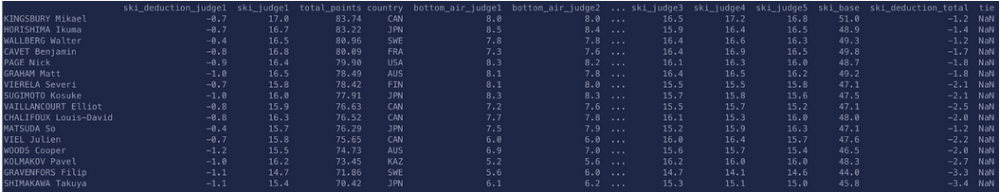
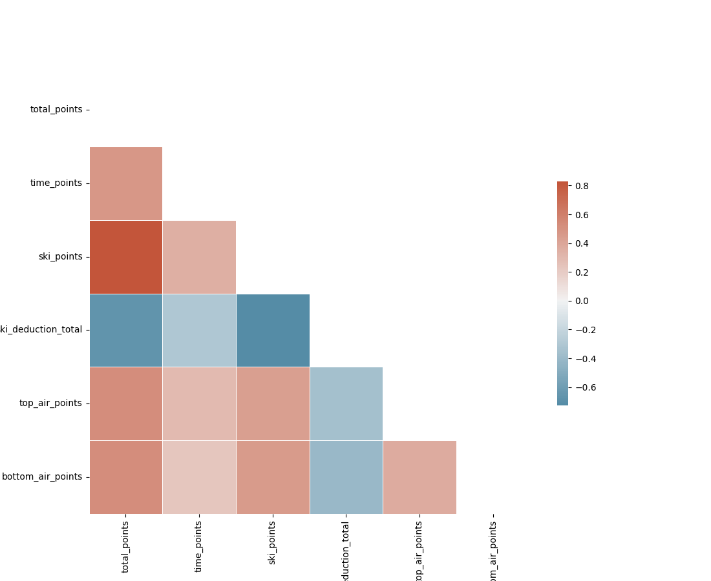
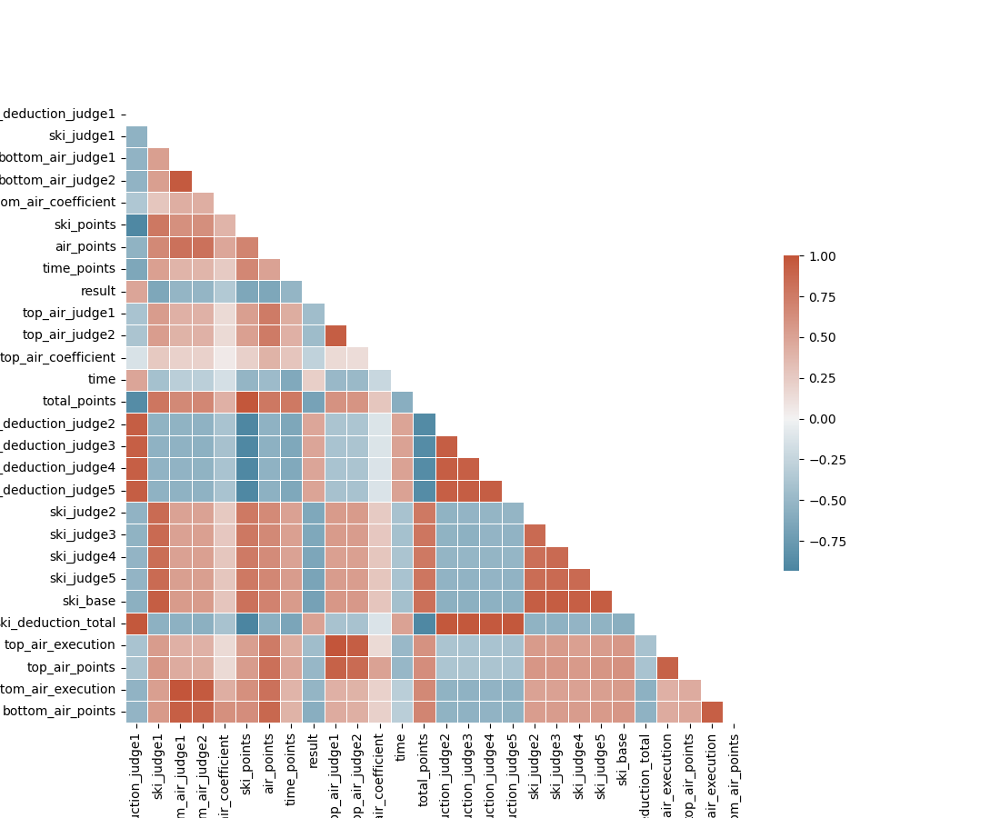

# Rapport projet IA

Hugo BRUCKER, Tom JEANNESON, Adame ABDELAZIZ, Julian COUX

## 1. Etude du sujet

## 1.1. La question étudiée

Nous sommes tous skieurs, dont Tom qui a été sportif de haut niveau en ski de bosses. Nous avons décidé de construire ce projet autour de cette passion commune. Tom ayant baigné dans ce sport depuis tout petit, il a pu voir les évolutions techniques utilisées par les coachs s’adapter au mieux à leurs athlètes. Les entraînements sont de plus en plus destinés à améliorer les techniques pouvant rapporter plus de points en compétition. À l’heure de l’explosion de l’intelligence artificielle, celle-ci n’est pas encore utilisée en ski de bosses et peut amener une réelle amélioration au sport. Aujourd’hui, les entraîneurs se contentent d’analyse de tableaux excel fait à la main avec des statistiques quasi inexistantes. L'apport d'outils d’analyses tel que celui-ci serait un grand plus dans le sport.
Ainsi, comment peut-on améliorer ce sport à l’aide d’outils d’IA ?

## 1.2. Les données à utiliser pour répondre à la question

Nous allons nous pencher sur un jeu de données des compétitions sur le circuit coupe du monde sur les trois dernières saisons (obtenu par Tom, dans le cadre de son PFE).

Les données ont initialement la forme suivante (elles sont contenues dans un PDF de résultats) :

Elles sont ensuite extraites et agrégées dans des dataframes pandas.

C’est sur ces dataframes que nous allons travailler.

## 2. Travail d'extraction de donnée

## 2.1. Algorithmes d'extraction

Les premiers algorithmes d'extraction et de transformation des données sont implémentés dans le module *DataSource* ([voir ici](https://github.com/tomjeannesson/ENSIMAG3A-COD-IA/blob/main/lib/data_source.py)).  
Un des algorithmes initiaux transforme notre base de données (au format JSON, [voir ici](https://raw.githubusercontent.com/tomjeannesson/ENSIMAG3A-COD-IA/refs/heads/main/data.json)) en une structure de données exploitable : une liste de *DataFrames*. Chaque *DataFrame* représente une course et présente les informations de chaque athlète sous forme de tableau, de manière à faciliter l'analyse ultérieure :

Afin de conserver un maximum d'informations pour une utilisation ultérieure, nous avons ajouté un attribut supplémentaire aux *DataFrames* (*dataframe.metadata*), contenant des métadonnées pour chaque course ([voir ici](https://github.com/tomjeannesson/ENSIMAG3A-COD-IA/blob/main/lib/dataframe_metadata.py)). Cet attribut enregistre des informations telles que le circuit (par exemple, World Cup "WC", European Cup "EC"), le genre (Homme "M" ou Femme "W"), l'année, le lieu et le type de course (Finale "F", Super-Finale "F1" ou Qualification "Q").

Une seconde fonction permet de filtrer les courses selon des critères spécifiques ([voir ici](https://github.com/tomjeannesson/ENSIMAG3A-COD-IA/blob/main/lib/data_source.py)). Par défaut, cette sélection s’effectue avec une structure de paramètres en tableau : `[[circuit], [genre], [année], [lieu], [type de course]]`. Par exemple, pour récupérer les *DataFrames* représentant des courses de Finale ou Super-Finale en World Cup pour les hommes en 2024, les paramètres seraient `[['WC'], ['M'], ['2024'], [], ['F', 'F1']]`.

Cette fonction intègre également un mode de filtrage permettant de définir si les paramètres doivent être inclus ou exclus, via un choix entre les modes "include" et "exclude".

En plus de ce filtrage par défaut, pour plus de flexibilité, nous avons intégré la possibilité d'appliquer un filtre personnalisé. La fonction accepte donc en paramètre une fonction de filtrage qui renvoie *True* si le *DataFrame* correspond aux critères spécifiés, permettant ainsi d’adapter les filtres aux besoins spécifiques de l'application.

Enfin, nous avons ajouté une fonction *query* qui permet d'effectuer des requêtes directement sur les *DataFrames* en utilisant la méthode *query* de Pandas, facilitant ainsi des recherches plus complexes.

## 2.2. Traitement des données

Afin de pouvoir exploiter les données agrégées dans les Dataframes évoqués ci-dessus, nous avons développé une classe nommé Extractor ([voir ici](https://github.com/tomjeannesson/ENSIMAG3A-COD-IA/blob/main/lib/extractor.py)).

Pour cette classe, on passe au constructeur une liste de Dataframes (récupérés précédemment), et nous venons les regrouper selon une dimension. Pour l’instant, nous pouvons les regrouper pour un athlète (récupérer ses statistiques globales sur l’ensemble de ces Dataframes) ou pour une compétition (récupérer les min, max et moyennes de chacun des critères de notation). Nous avons également comme ambition de faire ce même travail pour la dimension des pays.

## 3. Clustering des Athlètes

Ce projet utilise des techniques de clustering (K-Means) et de réduction de dimension (PCA) pour analyser et visualiser des données d'athlètes. Il génère des graphiques permettant d'explorer les clusters dans différentes dimensions.

## 3.1. Description

### 3.1.1. Étapes principales

1. Extraction des données depuis un fichier JSON via une classe `DataSource`.
2. Prétraitement des données et filtrage des variables pertinentes.
3. Clustering avec l'algorithme K-Means.
4. Visualisation des clusters dans :
   - L'espace des variables originales (pair plots).
   - Un espace réduit à 2 dimensions grâce à la PCA.
5. Calcul de probabilités du passage de la prochaine étape

### 3.1.2. Bibliothèques utilisées

- **`os`** : Gestion des dossiers.
- **`matplotlib`** : Création et sauvegarde des graphiques.
- **`seaborn`** : Visualisation avancée des données.
- **`sklearn.cluster.KMeans`** : Algorithme de clustering.
- **`sklearn.decomposition.PCA`** : Réduction de dimension.

---

## 3.2. Cluster

### 3.2.1 Clustering avec 3 clusters

#### 3.2.1.1 Pair Plot

Ce graphique montre les relations entre toutes les variables, avec les clusters colorés en fonction des résultats du modèle.

#### 3.2.1.2 PCA à 2 dimensions

Les clusters sont représentés dans un espace réduit à 2 dimensions à l'aide de la PCA.

#### 3.2.1.2 Analyse

L'analyse des 3 clusters confirme une répartition logique des athlètes en fonction de leurs performances. Les clusters identifiés reflètent trois groupes bien distincts :

- **Athlètes forts partout** : ils excellent dans tous les domaines évalués.
- **Athlètes moyens partout** : ils obtiennent des performances équilibrées, sans exceller ni faiblir significativement.
- **Athlètes faibles partout** : leurs scores sont globalement inférieurs sur tous les critères.

Bien que ces observations ne révèlent rien de nouveau, elles valident que la segmentation des athlètes est cohérente avec leurs notes.

---

### 3.2.2 Clustering avec 4 clusters

L'analyse avec 3 clusters nous a permis de confirmer une répartition assez simple des athlètes, mais elle n'a pas vraiment apporté de nouvelles informations. Pour affiner l'analyse, nous avons décidé de tester avec 4 clusters. Cette segmentation plus détaillée permet de mieux capturer les différences subtiles entre les athlètes et offre une vision plus précise de leurs performances.

#### 3.2.2.1 Pair Plot

Ce graphique montre les relations entre toutes les variables, avec les clusters colorés en fonction des résultats du modèle.

#### 3.2.2.2 PCA à 2 dimensions

Les clusters sont représentés dans un espace réduit à 2 dimensions à l'aide de la PCA.

#### 3.2.2.3 Analyse

##### Analyse Pair Plot

Cette analyse avec 4 clusters s'avère bien plus pertinente que la précédente, car elle permet d'identifier des groupes de skieurs supplémentaires, offrant une compréhension plus fine des performances. On retrouve toujours un **groupe d'athlètes très performants** (excellents dans tous les domaines) et un **groupe moins performant**, mais ce sont les deux groupes intermédiaires qui rendent cette analyse particulièrement intéressante.

En examinant le graphique Pair Plot, il apparaît clairement que ces deux groupes intermédiaires diffèrent en termes de points obtenus dans certaines catégories. Voici leurs caractéristiques principales :

- **Athlètes axés sur la technique de saut :**
Ces skieurs obtiennent de bons résultats en `air_points`, reflétant une technique de saut très soignée. En revanche, leurs `time_points` sont plus faibles, ce qui indique qu'ils adoptent un rythme de descente plus lent.
- **Athlètes axés sur la vitesse :**
Ces skieurs se démarquent par d'excellents `time_points`, témoignant d'une grande rapidité. Cependant, leurs `air_points` sont plus faibles, traduisant des sauts moins techniques ou moins bien notés.

Ces deux catégories de skieurs de niveau moyen illustrent une tendance intéressante : pour atteindre un niveau intermédiaire, les athlètes semblent se spécialiser soit dans la **vitesse**, au détriment de la technique, soit dans une **meilleure exécution des sauts**, mais avec une descente plus lente. Ces observations pourraient fournir des pistes précieuses pour adapter les stratégies d'entraînement selon les profils des athlètes.

##### Analyse PCA

Ces observations sont confirmées par l’analyse en composantes principales (PCA) en 2 dimensions. Le graphique met en évidence les **trois groupes principaux** : très performants, moyens et moins performants.
Comme indiqué précédemment, le groupe des athlètes moyens se scinde en **deux sous-groupes distincts**, correspondant aux profils déjà identifiés : les skieurs axés sur la vitesse et ceux axés sur la technique de saut.

### 3.3 Calculs de corrélation

Avant de nous pencher sur des algorithmes de prédiction, nous avons décidé d'étudier la corrélation entre les différentes features de notre jeu de données, afin de bien comprendre comment elles interragissent entre elles.

Voici la correlation entre les six principales features du dataset.

Et voici les correlations entre toutes les features:

### 3.4 Probabilités de qualification en finale

Pour cette partie, nous nous demandons à quel point il est possible de prédire les chances qu'a un athlète de se qualifier en finale d'une coupe du monde.
Le travail préalable consiste à s'intéresser au "breakpoints" de points d'entrée en finale et super-finale, visibles sur cette figure:

### 3.2.4 Régression logistique

Rien à dire pour le moment
TODO : ajouter l'analyse

Nous comptons ensuite prolonger cette étude en entrainant un réseau de neuronnes afin d'effectuer ces prédictions.

### 3.2.5 SVM

Un **SVM** (*Support Vector Machine*, ou **machine à vecteurs de support** en français) est un algorithme d'apprentissage supervisé utilisé en **apprentissage automatique** pour résoudre des problèmes de classification et de régression. Il est particulièrement adapté pour :

- Les jeux de données de petite ou moyenne taille.
- Les problèmes où les classes sont bien séparées.

Le SVM cherche à trouver l'**hyperplan** qui sépare au mieux les données en fonction de leurs catégories (dans un problème de classification). Cet hyperplan est choisi de manière à maximiser la **marge**, c'est-à-dire la distance entre l'hyperplan et les points de données les plus proches, appelés **vecteurs de support**.

- **Hyperplan** : Une surface de séparation dans un espace multidimensionnel (par exemple, une ligne en 2D, un plan en 3D, etc.).
- **Vecteurs de support** : Les points de données les plus proches de l'hyperplan, qui influencent sa position.

## 4. Enjeux environnementaux et sociétaux

### 4.1. Enjeux sociétaux

Le ski de bosses, bien moins médiatisé que d'autres sports, dispose de ressources limitées pour des analyses avancées. L'introduction d'un outil basé sur l'IA offrirait une aide précieuse aux entraîneurs et athlètes, en optimisant les performances et en renforçant la compétitivité, même dans des disciplines moins populaires.

Nos observations via des études Open Data montrent une relative parité hommes-femmes dans ce sport, bien que les hommes restent majoritaires. Ces données permettent de mettre en lumière des pistes pour promouvoir davantage l’inclusion et l’équité dans la discipline, contribuant à des avancées sociétales durables dans le sport de haut niveau.

### 4.2. Enjeux environnementaux

Grâce à une base de données légère, ce projet a une faible empreinte énergétique, rendant son déploiement respectueux de l’environnement. Par ailleurs, des applications futures pourraient inclure l’optimisation des infrastructures sportives ou la réduction des déplacements des équipes, participant ainsi à des pratiques sportives plus durables.

En combinant progrès technologique, équité sociétale et respect de l’environnement, ce projet démontre que performance et responsabilité peuvent aller de pair.

## 5. Bibliographie

- [Apprentissage non-supervisé avec Python](https://www.youtube.com/watch?v=FTtzd31IAOw)
- [Régression logistique avec Python](https://www.datacamp.com/fr/tutorial/understanding-logistic-regression-python)
- [Clustering avec Sklearn](https://scikit-learn.org/1.5/modules/clustering.html)
- [Documentation Matplotlib](https://matplotlib.org/stable/index.html)
